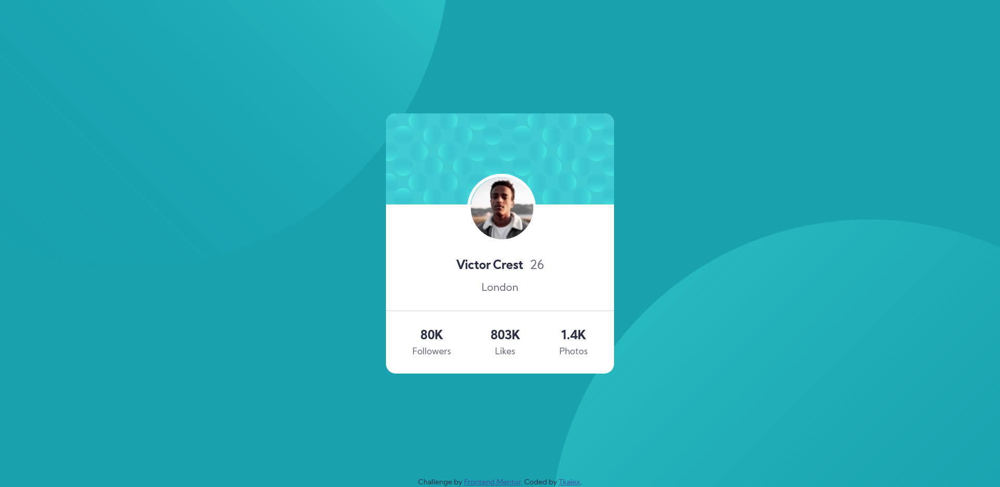

# Frontend Mentor - Profile card component solution

## Welcome! 👋

Thanks for checking out this front-end coding challenge.

### Screenshot

### Links

- Solution URL: [Solution](https://github.com/Tkalex32/fementor-profilecard)
- Live Site URL: [Live Site](https://fementor-profilecard.netlify.app/)

## My process

### Built with

- HTML5
- CSS
- Flexbox
- Sass

## Author

- Website - [github](https://github.com/Tkalex32/)
- Frontend Mentor - [@Tkalex32](https://www.frontendmentor.io/profile/Tkalex32)